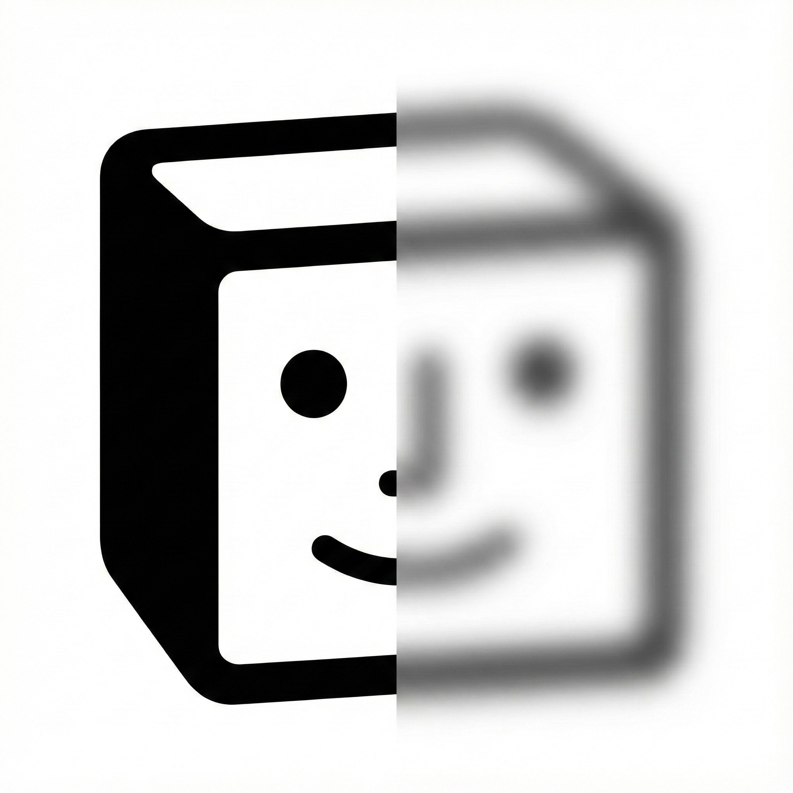

<p align="center">
  
</p>

# Face Blur Pro

<p align="center">
  
  
  
  
  
  
</p>

<p align="center">
  
  
  
</p>

> 🤖 **Built with [Antigravity](https://antigravity.google/) + Gemini 3 Model** — This app was created using **Vibe Coding**, an AI-assisted development approach powered by Gemini 3.
>
> ☁️ **Google Cloud credits are provided for this project.** #AISprintH2

Face Blur Pro is a cross-platform Flutter application designed to enhance privacy by detecting and blurring faces in images. It demonstrates a powerful hybrid architecture, leveraging on-device ML for mobile, ONNX Runtime Web for browser, and a Rust-based backend for desktop performance.

## ✨ Key Features

*   **Cross-Platform Support**: Runs smoothly on **iOS, Android, macOS, Windows, Linux, and Web**.
*   **Hybrid Face Detection**:
    *   **Mobile (Android/iOS)**: Utilizes Google ML Kit for fast, efficient on-device detection.
    *   **Desktop (macOS/Windows/Linux)**: Powered by a Rust backend using `tract-onnx` and the `version-RFB-640.onnx` model.
    *   **Web**: Uses ONNX Runtime Web with the same `version-RFB-640.onnx` model for consistent detection across platforms.
*   **Manual Region Selection**: Draw custom blur regions when face detection misses faces. Supports drag-to-draw and long-press to delete.
*   **Privacy-First**: All processing is performed locally on your device. No images are ever uploaded to the cloud.
*   **Rust-Powered Image Processing**: Uses the `image` crate in Rust for high-performance pixel manipulation and blurring.
*   **Flexible Blurring**: Choose between **Rectangular** or **Circular** blur shapes.
*   **Share & Save**: Easily save your edited images to the gallery or share them directly with other apps.

## 🖥️ Supported Platforms

| Platform | Face Detection | Blur Processing | Status |
|----------|---------------|-----------------|--------|
| **iOS** | Google ML Kit | Rust FFI | ✅ Supported |
| **Android** | Google ML Kit | Rust FFI | ✅ Supported |
| **macOS** | ONNX (Rust) | Rust FFI | ✅ Supported |
| **Windows** | ONNX (Rust) | Rust FFI | ✅ Supported |
| **Linux** | ONNX (Rust) | Rust FFI | ✅ Supported |
| **Web** | ONNX Runtime Web | Canvas API | ✅ Supported |

## 🛠️ Tech Stack

*   **Frontend**: [Flutter](https://flutter.dev/) (Dart)
*   **Backend**: [Rust](https://www.rust-lang.org/)
*   **Bridge**: [flutter_rust_bridge](https://github.com/fzyzcjy/flutter_rust_bridge) connects Dart and Rust.
*   **Mobile ML**: `google_mlkit_face_detection`
*   **Desktop ML**: `tract-onnx` (ONNX Runtime in pure Rust)
*   **Web ML**: ONNX Runtime Web with `version-RFB-640.onnx` (RetinaFace variant)
*   **Image Processing**: `image` crate (Rust) / Canvas API (Web)

## 🚀 Installation & Setup

### Prerequisites

Ensure you have the following installed on your system:

1.  **Flutter SDK**: [Install Flutter](https://docs.flutter.dev/get-started/install)
2.  **Rust Toolchain**: [Install Rust](https://www.rust-lang.org/tools/install)
3.  **C++ Build Tools**:
    *   **macOS**: Xcode (install via App Store or `xcode-select --install`)
    *   **Windows**: Visual Studio 2022 with "Desktop development with C++" workload.
    *   **Linux**: `build-essential`, `pkg-config`, `libgtk-3-dev` (depending on your distro).

### Steps

1.  **Clone the Repository**:
    ```bash
    git clone https://github.com/jaichangpark/face_blur_pro.git
    cd face_blur_pro
    ```

2.  **Install Flutter Dependencies**:
    ```bash
    flutter pub get
    ```

3.  **Run the App**:
    ```bash
    # iOS/Android
    flutter run
    
    # macOS
    flutter run -d macos
    
    # Web
    flutter run -d chrome
    ```

## 📱 Usage Guide

1.  **Pick an Image**: Tap the **📷 사진 열기** button to select a photo from your device.
2.  **Detect Faces**: The app will automatically run face detection. Detected faces will be highlighted with **red** boxes.
3.  **Select Faces**: Tap on any box to toggle selection. Selected faces will turn **green**.
4.  **Manual Drawing** (New!): 
    *   Tap the **✏️ Edit** icon to enter drawing mode.
    *   Drag on the image to draw custom blur regions (shown in **blue**).
    *   Long-press to delete manually added regions.
5.  **Choose Blur Style**: Toggle between **Circle** and **Rectangle** icons to change the blur shape.
6.  **Apply Blur**: Tap the **블러 실행** button. The selected areas will be blurred.
7.  **Save/Share**:
    *   Tap the **💾 Save** icon to save the image to your gallery.
    *   Tap the **🔗 Share** icon to send the image to another app.

## 📂 Project Structure

```
face_blur_pro/
├── lib/                          # Flutter (Dart) code
│   ├── main.dart                 # Entry point
│   ├── data/models/              # Data models (MyFace, BlurShape)
│   ├── domain/services/          # Business logic services
│   │   ├── image_processing_service.dart
│   │   ├── web_face_service.dart       # Web platform conditional import
│   │   ├── web_face_service_web.dart   # Web implementation
│   │   └── web_face_service_stub.dart  # Native stub
│   └── presentation/home/        # UI components
├── rust/                         # Rust backend
│   └── src/api/simple.rs         # Face detection & blur logic
├── web/                          # Web-specific files
│   ├── index.html                # ONNX Runtime Web scripts
│   └── face_blur_web.js          # JS face detection logic
└── assets/models/                # ONNX models
    └── version-RFB-640.onnx      # RetinaFace variant model
```

## 📄 License

This project is open-source. See the LICENSE file for details.
